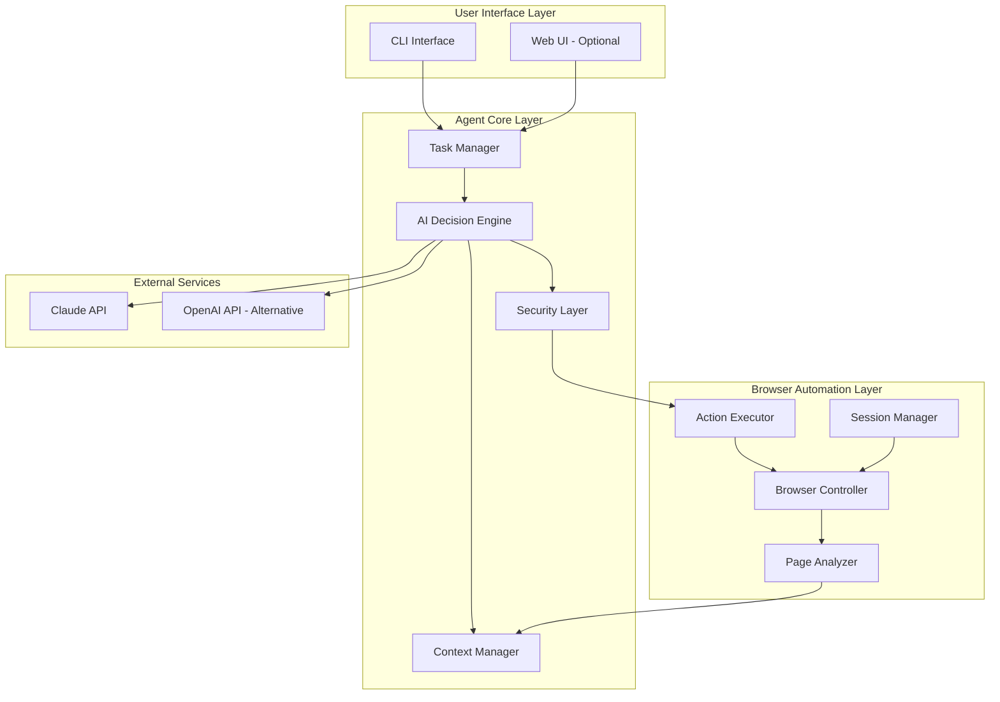
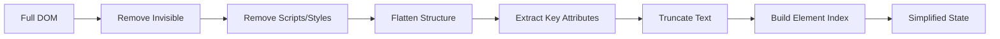
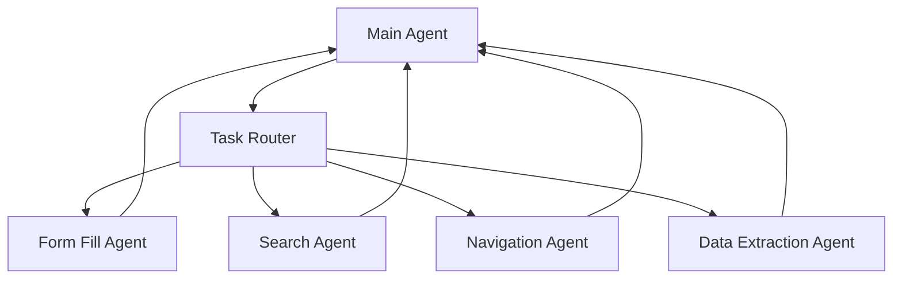

# AI Browser Agent - Architecture Document

## 1. Overview

This document describes the architecture of an autonomous AI Browser Agent that can control a web browser to perform complex multi-step tasks. The agent uses LLM (Claude/OpenAI) for decision-making and Playwright for browser automation.

### Key Principles:
- **Autonomous Decision Making** - No pre-defined steps, the agent determines actions dynamically
- **Dynamic Element Discovery** - No hardcoded selectors, the agent finds elements by analyzing the page
- **Adaptive Exploration** - No hardcoded URLs, the agent navigates based on visual/DOM analysis

---

## 2. High-Level Architecture



---

## 3. Component Details

### 3.1 User Interface Layer

#### CLI Interface
Primary interface for user interaction.

```python
# Example CLI interaction flow
class CLIInterface:
    """Command-line interface for the browser agent."""
    
    async def start(self):
        """Start the interactive CLI session."""
        print("AI Browser Agent started. Type your task or 'quit' to exit.")
        
        while True:
            user_input = await self.get_user_input()
            
            if user_input.lower() == 'quit':
                break
            elif user_input.startswith('/confirm'):
                await self.handle_confirmation(user_input)
            elif user_input.startswith('/cancel'):
                await self.cancel_pending_action()
            else:
                await self.agent.execute_task(user_input)
    
    async def display_action_request(self, action: dict):
        """Display action requiring user confirmation."""
        print(f"\n⚠️  Action requires confirmation:")
        print(f"   Type: {action['type']}")
        print(f"   Target: {action['target']}")
        print(f"   Details: {action['description']}")
        print("Type /confirm to proceed or /cancel to abort")
```

#### Web UI (Optional)
Simple web interface for visual monitoring and control.

### 3.2 Agent Core Layer

#### Task Manager
Orchestrates the overall task execution lifecycle.

```python
class TaskManager:
    """Manages task lifecycle and agent coordination."""
    
    def __init__(self):
        self.current_task: Optional[Task] = None
        self.task_history: List[Task] = []
        self.sub_agents: Dict[str, SubAgent] = {}
    
    async def execute_task(self, user_request: str) -> TaskResult:
        """Execute a user task through the agent pipeline."""
        
        # 1. Create task context
        task = Task(
            id=generate_task_id(),
            request=user_request,
            status=TaskStatus.PLANNING
        )
        self.current_task = task
        
        # 2. Planning phase - AI determines the approach
        plan = await self.ai_engine.plan_task(task)
        
        # 3. Execution loop
        while not task.is_complete:
            # Get current page state
            page_state = await self.page_analyzer.get_state()
            
            # AI decides next action
            decision = await self.ai_engine.decide_next_action(
                task=task,
                page_state=page_state,
                history=task.action_history
            )
            
            # Handle completion or continue
            if decision.type == DecisionType.COMPLETE:
                task.complete(decision.result)
            elif decision.type == DecisionType.NEED_INFO:
                await self.request_user_input(decision.question)
            else:
                # Execute the action
                result = await self.execute_action(decision.action)
                task.action_history.append(result)
        
        return task.result
```

#### AI Decision Engine
Core intelligence component using LLM for reasoning.

```python
class AIDecisionEngine:
    """AI-powered decision making using Claude/OpenAI."""
    
    def __init__(self, config: AIConfig):
        self.client = self._init_client(config)
        self.model = config.model  # e.g., "claude-sonnet-4-20250514"
        self.tools = self._define_tools()
    
    async def decide_next_action(
        self,
        task: Task,
        page_state: PageState,
        history: List[ActionResult]
    ) -> Decision:
        """Determine the next action based on current state."""
        
        # Build context-aware prompt
        messages = self.context_manager.build_messages(
            task=task,
            page_state=page_state,
            history=history
        )
        
        # Call LLM with tool definitions
        response = await self.client.messages.create(
            model=self.model,
            max_tokens=4096,
            tools=self.tools,
            messages=messages
        )
        
        # Parse and validate response
        return self._parse_decision(response)
    
    def _define_tools(self) -> List[dict]:
        """Define available tools/functions for the AI."""
        return [
            # See Section 5 for complete tool definitions
        ]
```

#### Context Manager
Manages conversation history and token optimization.

```python
class ContextManager:
    """Manages context window and token optimization."""
    
    MAX_CONTEXT_TOKENS = 100000  # Claude's context window
    TARGET_USAGE = 0.7  # Use 70% of context max
    
    def __init__(self):
        self.conversation_history: List[Message] = []
        self.page_state_cache: Dict[str, PageState] = {}
        self.summarized_history: List[str] = []
    
    def build_messages(
        self,
        task: Task,
        page_state: PageState,
        history: List[ActionResult]
    ) -> List[dict]:
        """Build optimized message array for LLM."""
        
        messages = []
        
        # System message with agent instructions
        messages.append({
            "role": "system",
            "content": self._get_system_prompt()
        })
        
        # Task context
        messages.append({
            "role": "user",
            "content": f"Task: {task.request}"
        })
        
        # Summarized history (if needed)
        if self._should_summarize(history):
            summary = self._summarize_history(history)
            messages.append({
                "role": "assistant",
                "content": f"Previous actions summary: {summary}"
            })
        else:
            # Full history
            for action_result in history[-10:]:  # Last 10 actions
                messages.extend(self._format_action(action_result))
        
        # Current page state (simplified)
        messages.append({
            "role": "user",
            "content": self._format_page_state(page_state)
        })
        
        return messages
    
    def _should_summarize(self, history: List[ActionResult]) -> bool:
        """Determine if history needs summarization."""
        estimated_tokens = self._estimate_tokens(history)
        return estimated_tokens > self.MAX_CONTEXT_TOKENS * self.TARGET_USAGE
```

#### Security Layer
Handles confirmation for sensitive/destructive actions.

```python
class SecurityLayer:
    """Security controls for destructive actions."""
    
    # Actions requiring confirmation
    SENSITIVE_PATTERNS = [
        "delete", "remove", "submit", "purchase", "buy",
        "send", "transfer", "payment", "checkout", "confirm order"
    ]
    
    # URLs/domains requiring extra caution
    SENSITIVE_DOMAINS = [
        "bank", "payment", "checkout", "admin"
    ]
    
    async def check_action(
        self,
        action: BrowserAction,
        page_url: str
    ) -> SecurityDecision:
        """Evaluate if action requires user confirmation."""
        
        risk_level = self._assess_risk(action, page_url)
        
        if risk_level == RiskLevel.HIGH:
            return SecurityDecision(
                requires_confirmation=True,
                reason=f"High-risk action: {action.description}",
                action=action
            )
        elif risk_level == RiskLevel.MEDIUM:
            # Log but allow
            self._log_action(action, "medium risk")
            return SecurityDecision(requires_confirmation=False)
        else:
            return SecurityDecision(requires_confirmation=False)
    
    def _assess_risk(self, action: BrowserAction, url: str) -> RiskLevel:
        """Assess the risk level of an action."""
        
        # Check action content
        action_text = action.description.lower()
        for pattern in self.SENSITIVE_PATTERNS:
            if pattern in action_text:
                return RiskLevel.HIGH
        
        # Check URL
        for domain_pattern in self.SENSITIVE_DOMAINS:
            if domain_pattern in url.lower():
                return RiskLevel.MEDIUM
        
        return RiskLevel.LOW
```

### 3.3 Browser Automation Layer

#### Browser Controller
Playwright-based browser management.

```python
class BrowserController:
    """Manages Playwright browser instance."""
    
    def __init__(self, config: BrowserConfig):
        self.config = config
        self.playwright: Optional[Playwright] = None
        self.browser: Optional[Browser] = None
        self.context: Optional[BrowserContext] = None
        self.page: Optional[Page] = None
    
    async def initialize(self):
        """Initialize browser with persistent context."""
        
        self.playwright = await async_playwright().start()
        
        # Use persistent context for session preservation
        self.context = await self.playwright.chromium.launch_persistent_context(
            user_data_dir=self.config.user_data_dir,
            headless=False,  # Visible browser
            viewport={"width": 1280, "height": 800},
            slow_mo=100,  # Slight delay for visibility
            args=[
                "--disable-blink-features=AutomationControlled",
                "--no-sandbox"
            ]
        )
        
        # Get or create page
        if self.context.pages:
            self.page = self.context.pages[0]
        else:
            self.page = await self.context.new_page()
        
        # Set up event listeners
        self.page.on("dialog", self._handle_dialog)
        self.page.on("popup", self._handle_popup)
    
    async def _handle_dialog(self, dialog: Dialog):
        """Handle JavaScript dialogs - alert, confirm, prompt."""
        dialog_info = {
            "type": dialog.type,
            "message": dialog.message
        }
        # Notify AI engine about dialog
        await self.event_queue.put(("dialog", dialog_info))
        
        # Wait for AI decision on how to handle
        decision = await self.dialog_decision_queue.get()
        if decision.accept:
            await dialog.accept(decision.text)
        else:
            await dialog.dismiss()
    
    async def _handle_popup(self, popup: Page):
        """Handle new popup windows."""
        popup_info = {
            "url": popup.url,
            "title": await popup.title()
        }
        await self.event_queue.put(("popup", popup_info))
```

#### Page Analyzer
Extracts and simplifies page content for AI consumption.

```python
class PageAnalyzer:
    """Analyzes and simplifies page content."""
    
    async def get_state(self) -> PageState:
        """Get current page state in AI-friendly format."""
        
        page = self.browser_controller.page
        
        # Basic page info
        state = PageState(
            url=page.url,
            title=await page.title(),
            timestamp=datetime.now()
        )
        
        # Extract simplified DOM
        state.dom = await self._extract_simplified_dom()
        
        # Extract interactive elements
        state.interactive_elements = await self._extract_interactive_elements()
        
        # Extract visible text (chunked)
        state.visible_text = await self._extract_visible_text()
        
        # Take screenshot for vision (optional)
        if self.config.use_vision:
            state.screenshot = await self._capture_screenshot()
        
        return state
    
    async def _extract_simplified_dom(self) -> str:
        """Extract simplified DOM structure."""
        
        # JavaScript to simplify DOM
        simplified = await self.page.evaluate("""
            () => {
                function simplifyNode(node, depth = 0) {
                    if (depth > 5) return '';  // Limit depth
                    
                    const result = [];
                    const tag = node.tagName?.toLowerCase();
                    
                    // Skip non-visible and script elements
                    if (['script', 'style', 'noscript', 'svg', 'path'].includes(tag)) {
                        return '';
                    }
                    
                    // Check visibility
                    const style = window.getComputedStyle(node);
                    if (style.display === 'none' || style.visibility === 'hidden') {
                        return '';
                    }
                    
                    // Build node representation
                    const attrs = [];
                    
                    if (node.id) attrs.push(`id="${node.id}"`);
                    if (node.className && typeof node.className === 'string') {
                        const classes = node.className.split(' ').slice(0, 3).join(' ');
                        if (classes) attrs.push(`class="${classes}"`);
                    }
                    
                    // Important attributes for interaction
                    if (node.href) attrs.push(`href="${node.href.substring(0, 50)}"`);
                    if (node.name) attrs.push(`name="${node.name}"`);
                    if (node.type) attrs.push(`type="${node.type}"`);
                    if (node.placeholder) attrs.push(`placeholder="${node.placeholder}"`);
                    if (node.value && tag === 'input') attrs.push(`value="${node.value.substring(0, 20)}"`);
                    if (node.getAttribute('aria-label')) {
                        attrs.push(`aria-label="${node.getAttribute('aria-label')}"`);
                    }
                    if (node.getAttribute('role')) {
                        attrs.push(`role="${node.getAttribute('role')}"`);
                    }
                    
                    const attrStr = attrs.length ? ' ' + attrs.join(' ') : '';
                    const indent = '  '.repeat(depth);
                    
                    // Text content (trimmed)
                    let text = '';
                    if (node.childNodes.length === 1 && node.childNodes[0].nodeType === 3) {
                        text = node.textContent.trim().substring(0, 100);
                    }
                    
                    // Build output
                    if (tag) {
                        result.push(`${indent}<${tag}${attrStr}>${text}`);
                        
                        // Process children
                        for (const child of node.children) {
                            const childResult = simplifyNode(child, depth + 1);
                            if (childResult) result.push(childResult);
                        }
                        
                        if (!text && node.children.length > 0) {
                            result.push(`${indent}</${tag}>`);
                        }
                    }
                    
                    return result.join('\\n');
                }
                
                return simplifyNode(document.body);
            }
        """)
        
        return simplified
    
    async def _extract_interactive_elements(self) -> List[InteractiveElement]:
        """Extract all interactive elements with their properties."""
        
        elements = await self.page.evaluate("""
            () => {
                const interactive = [];
                const selectors = [
                    'a[href]',
                    'button',
                    'input',
                    'select',
                    'textarea',
                    '[onclick]',
                    '[role="button"]',
                    '[role="link"]',
                    '[tabindex]'
                ];
                
                const elements = document.querySelectorAll(selectors.join(','));
                
                elements.forEach((el, index) => {
                    const rect = el.getBoundingClientRect();
                    
                    // Skip invisible elements
                    if (rect.width === 0 || rect.height === 0) return;
                    if (rect.top > window.innerHeight || rect.bottom < 0) return;
                    
                    const info = {
                        index: index,
                        tag: el.tagName.toLowerCase(),
                        type: el.type || null,
                        text: (el.textContent || el.value || el.placeholder || '').trim().substring(0, 100),
                        id: el.id || null,
                        name: el.name || null,
                        href: el.href || null,
                        ariaLabel: el.getAttribute('aria-label'),
                        role: el.getAttribute('role'),
                        position: {
                            x: Math.round(rect.x + rect.width / 2),
                            y: Math.round(rect.y + rect.height / 2)
                        },
                        size: {
                            width: Math.round(rect.width),
                            height: Math.round(rect.height)
                        },
                        isVisible: true,
                        isEnabled: !el.disabled
                    };
                    
                    interactive.push(info);
                });
                
                return interactive;
            }
        """)
        
        return [InteractiveElement(**el) for el in elements]
```

#### Action Executor
Executes browser actions determined by AI.

```python
class ActionExecutor:
    """Executes browser actions."""
    
    async def execute(self, action: BrowserAction) -> ActionResult:
        """Execute a browser action and return result."""
        
        page = self.browser_controller.page
        
        try:
            match action.type:
                case ActionType.NAVIGATE:
                    return await self._navigate(action.url)
                
                case ActionType.CLICK:
                    return await self._click(action.target)
                
                case ActionType.TYPE:
                    return await self._type(action.target, action.text)
                
                case ActionType.SELECT:
                    return await self._select(action.target, action.value)
                
                case ActionType.SCROLL:
                    return await self._scroll(action.direction, action.amount)
                
                case ActionType.WAIT:
                    return await self._wait(action.condition, action.timeout)
                
                case ActionType.SCREENSHOT:
                    return await self._screenshot()
                
                case ActionType.EXTRACT:
                    return await self._extract(action.target)
                
                case _:
                    return ActionResult(
                        success=False,
                        error=f"Unknown action type: {action.type}"
                    )
                    
        except Exception as e:
            return ActionResult(
                success=False,
                error=str(e),
                screenshot=await self._capture_error_screenshot()
            )
    
    async def _click(self, target: ElementTarget) -> ActionResult:
        """Click on an element."""
        
        # Find element using AI-provided selector strategy
        element = await self._find_element(target)
        
        if not element:
            return ActionResult(
                success=False,
                error=f"Element not found: {target}"
            )
        
        # Scroll into view if needed
        await element.scroll_into_view_if_needed()
        
        # Wait for element to be clickable
        await element.wait_for_element_state("visible")
        await element.wait_for_element_state("enabled")
        
        # Click
        await element.click()
        
        # Wait for potential navigation or update
        await self._wait_for_stability()
        
        return ActionResult(
            success=True,
            message=f"Clicked on element: {target}"
        )
    
    async def _find_element(self, target: ElementTarget) -> Optional[ElementHandle]:
        """Find element using multiple strategies."""
        
        page = self.browser_controller.page
        
        # Strategy 1: By index from interactive elements
        if target.element_index is not None:
            elements = await self.page_analyzer._extract_interactive_elements()
            if target.element_index < len(elements):
                el_info = elements[target.element_index]
                # Use position-based selection
                element = await page.locator(
                    f"xpath=//*[contains(., '{el_info.text[:20]}')]"
                ).first
                if await element.count() > 0:
                    return await element.element_handle()
        
        # Strategy 2: By text content
        if target.text:
            element = page.get_by_text(target.text, exact=False).first
            if await element.count() > 0:
                return await element.element_handle()
        
        # Strategy 3: By role and name
        if target.role:
            element = page.get_by_role(target.role, name=target.name).first
            if await element.count() > 0:
                return await element.element_handle()
        
        # Strategy 4: By CSS selector (AI-generated)
        if target.css_selector:
            element = page.locator(target.css_selector).first
            if await element.count() > 0:
                return await element.element_handle()
        
        # Strategy 5: By coordinates (fallback)
        if target.coordinates:
            # Click at coordinates
            await page.mouse.click(
                target.coordinates.x,
                target.coordinates.y
            )
            return None  # No element handle, but action performed
        
        return None
```

#### Session Manager
Manages browser sessions and authentication persistence.

```python
class SessionManager:
    """Manages browser sessions and state persistence."""
    
    def __init__(self, config: SessionConfig):
        self.config = config
        self.storage_path = Path(config.storage_path)
        self.storage_path.mkdir(parents=True, exist_ok=True)
    
    async def save_session(self, name: str):
        """Save current browser session."""
        
        context = self.browser_controller.context
        
        # Save storage state (cookies, localStorage)
        storage_state = await context.storage_state()
        
        session_file = self.storage_path / f"{name}.json"
        with open(session_file, 'w') as f:
            json.dump(storage_state, f, indent=2)
        
        return session_file
    
    async def load_session(self, name: str) -> bool:
        """Load a saved session."""
        
        session_file = self.storage_path / f"{name}.json"
        
        if not session_file.exists():
            return False
        
        with open(session_file, 'r') as f:
            storage_state = json.load(f)
        
        # Apply to context
        # Note: For persistent context, recreate with storage state
        await self.browser_controller.context.add_cookies(
            storage_state.get('cookies', [])
        )
        
        return True
    
    async def list_sessions(self) -> List[str]:
        """List available saved sessions."""
        
        return [
            f.stem for f in self.storage_path.glob("*.json")
        ]
```

---

## 4. DOM Simplification Strategy

### 4.1 Core Principles

1. **Reduce Token Usage** - Full HTML pages can be 100k+ tokens; we need to reduce to ~5-10k
2. **Preserve Semantic Information** - Keep meaningful structure and labels
3. **Prioritize Interactive Elements** - Buttons, links, inputs are most important
4. **Include Visual Context** - Position and visibility matter

### 4.2 Simplification Pipeline



### 4.3 Output Format

```json
{
  "url": "https://example.com/page",
  "title": "Example Page Title",
  "viewport": {"width": 1280, "height": 800},
  
  "interactive_elements": [
    {
      "index": 0,
      "tag": "button",
      "text": "Submit Order",
      "position": {"x": 640, "y": 400},
      "attributes": {"class": "btn-primary", "id": "submit-btn"}
    },
    {
      "index": 1,
      "tag": "input",
      "type": "text",
      "placeholder": "Enter email",
      "position": {"x": 400, "y": 200},
      "attributes": {"name": "email", "required": true}
    }
  ],
  
  "page_structure": {
    "header": "Main navigation with 5 links",
    "main": "Form with 3 inputs and 1 submit button",
    "footer": "Copyright and social links"
  },
  
  "visible_text_summary": "Page shows a checkout form asking for email, address, and payment information..."
}
```

### 4.4 Adaptive Detail Level

```python
class AdaptivePageAnalyzer:
    """Adjusts detail level based on context."""
    
    async def get_state(self, detail_level: DetailLevel = DetailLevel.NORMAL) -> PageState:
        
        match detail_level:
            case DetailLevel.MINIMAL:
                # Just URL, title, and interactive elements
                return await self._minimal_state()
            
            case DetailLevel.NORMAL:
                # Standard analysis
                return await self._normal_state()
            
            case DetailLevel.DETAILED:
                # Include full DOM structure
                return await self._detailed_state()
            
            case DetailLevel.VISION:
                # Include screenshot for vision model
                return await self._vision_state()
```

---

## 5. Function/Tool Calling Schema

### 5.1 Tool Definitions for Claude API

```python
BROWSER_TOOLS = [
    {
        "name": "navigate",
        "description": "Navigate to a URL. Use this to go to a specific webpage.",
        "input_schema": {
            "type": "object",
            "properties": {
                "url": {
                    "type": "string",
                    "description": "The URL to navigate to"
                }
            },
            "required": ["url"]
        }
    },
    {
        "name": "click",
        "description": "Click on an element on the page. Use element index from the interactive_elements list, or describe the element.",
        "input_schema": {
            "type": "object",
            "properties": {
                "element_index": {
                    "type": "integer",
                    "description": "Index of the element from interactive_elements list"
                },
                "element_description": {
                    "type": "string",
                    "description": "Text description of the element to click (e.g., 'Submit button', 'Login link')"
                },
                "coordinates": {
                    "type": "object",
                    "properties": {
                        "x": {"type": "integer"},
                        "y": {"type": "integer"}
                    },
                    "description": "Fallback: click at specific coordinates"
                }
            }
        }
    },
    {
        "name": "type_text",
        "description": "Type text into an input field. First click on the field, then type.",
        "input_schema": {
            "type": "object",
            "properties": {
                "element_index": {
                    "type": "integer",
                    "description": "Index of the input element"
                },
                "element_description": {
                    "type": "string",
                    "description": "Description of the input field"
                },
                "text": {
                    "type": "string",
                    "description": "Text to type into the field"
                },
                "clear_first": {
                    "type": "boolean",
                    "description": "Whether to clear existing text first",
                    "default": True
                }
            },
            "required": ["text"]
        }
    },
    {
        "name": "select_option",
        "description": "Select an option from a dropdown/select element.",
        "input_schema": {
            "type": "object",
            "properties": {
                "element_index": {
                    "type": "integer",
                    "description": "Index of the select element"
                },
                "value": {
                    "type": "string",
                    "description": "Value or visible text of option to select"
                }
            },
            "required": ["value"]
        }
    },
    {
        "name": "scroll",
        "description": "Scroll the page to see more content.",
        "input_schema": {
            "type": "object",
            "properties": {
                "direction": {
                    "type": "string",
                    "enum": ["up", "down", "left", "right"],
                    "description": "Direction to scroll"
                },
                "amount": {
                    "type": "string",
                    "enum": ["small", "medium", "large", "page"],
                    "description": "Amount to scroll",
                    "default": "medium"
                },
                "to_element": {
                    "type": "integer",
                    "description": "Scroll to bring specific element into view"
                }
            },
            "required": ["direction"]
        }
    },
    {
        "name": "wait",
        "description": "Wait for something to happen on the page.",
        "input_schema": {
            "type": "object",
            "properties": {
                "condition": {
                    "type": "string",
                    "enum": ["load", "network_idle", "element_visible", "element_hidden", "time"],
                    "description": "What to wait for"
                },
                "timeout": {
                    "type": "integer",
                    "description": "Maximum time to wait in milliseconds",
                    "default": 5000
                },
                "element_description": {
                    "type": "string",
                    "description": "For element conditions, describe the element"
                }
            },
            "required": ["condition"]
        }
    },
    {
        "name": "extract_data",
        "description": "Extract specific data from the page.",
        "input_schema": {
            "type": "object",
            "properties": {
                "data_description": {
                    "type": "string",
                    "description": "Describe what data to extract (e.g., 'all product prices', 'the main article text')"
                },
                "format": {
                    "type": "string",
                    "enum": ["text", "list", "table", "json"],
                    "description": "Desired output format",
                    "default": "text"
                }
            },
            "required": ["data_description"]
        }
    },
    {
        "name": "go_back",
        "description": "Go back to the previous page in browser history.",
        "input_schema": {
            "type": "object",
            "properties": {}
        }
    },
    {
        "name": "refresh",
        "description": "Refresh the current page.",
        "input_schema": {
            "type": "object",
            "properties": {}
        }
    },
    {
        "name": "take_screenshot",
        "description": "Take a screenshot of the current page for visual analysis.",
        "input_schema": {
            "type": "object",
            "properties": {
                "full_page": {
                    "type": "boolean",
                    "description": "Capture full page or just viewport",
                    "default": False
                }
            }
        }
    },
    {
        "name": "complete_task",
        "description": "Mark the task as complete and provide the result.",
        "input_schema": {
            "type": "object",
            "properties": {
                "success": {
                    "type": "boolean",
                    "description": "Whether the task was completed successfully"
                },
                "result": {
                    "type": "string",
                    "description": "The result or output of the task"
                },
                "summary": {
                    "type": "string",
                    "description": "Brief summary of actions taken"
                }
            },
            "required": ["success", "result"]
        }
    },
    {
        "name": "ask_user",
        "description": "Ask the user for clarification or additional information.",
        "input_schema": {
            "type": "object",
            "properties": {
                "question": {
                    "type": "string",
                    "description": "The question to ask the user"
                },
                "options": {
                    "type": "array",
                    "items": {"type": "string"},
                    "description": "Optional list of suggested answers"
                }
            },
            "required": ["question"]
        }
    }
]
```

### 5.2 System Prompt

```python
SYSTEM_PROMPT = """You are an AI browser automation agent. You control a web browser to accomplish tasks given by the user.

## Your Capabilities
You can:
- Navigate to URLs
- Click on buttons, links, and other elements
- Type text into input fields
- Select options from dropdowns
- Scroll the page
- Extract information from pages
- Take screenshots for analysis

## How You Work
1. You receive a task from the user
2. You analyze the current page state (URL, title, interactive elements)
3. You decide on the next action to take
4. You execute the action using the available tools
5. You observe the result and continue until the task is complete

## Important Guidelines
- NEVER assume page structure - always analyze the provided page state
- Use element indices from the interactive_elements list when possible
- If an action fails, try alternative approaches
- Ask the user for clarification when needed
- Be cautious with sensitive actions (payments, deletions, form submissions)
- Report completion with clear results

## Page State Format
You receive page state as JSON with:
- url: Current page URL
- title: Page title
- interactive_elements: List of clickable/interactive elements with index, tag, text, position
- visible_text_summary: Summary of visible text content

## Responding
Always use a tool to take action. Analyze the page state carefully before deciding.
If you need to complete multiple steps, do them one at a time and observe results."""
```

---

## 6. Error Handling & Recovery

### 6.1 Error Categories

```python
class ErrorCategory(Enum):
    ELEMENT_NOT_FOUND = "element_not_found"
    NAVIGATION_FAILED = "navigation_failed"
    TIMEOUT = "timeout"
    NETWORK_ERROR = "network_error"
    AUTHENTICATION_REQUIRED = "auth_required"
    CAPTCHA_DETECTED = "captcha"
    PERMISSION_DENIED = "permission_denied"
    UNEXPECTED_STATE = "unexpected_state"
```

### 6.2 Recovery Strategies

```python
class ErrorRecoveryManager:
    """Handles error recovery with adaptive strategies."""
    
    async def handle_error(
        self,
        error: BrowserError,
        context: ErrorContext
    ) -> RecoveryAction:
        """Determine recovery action for an error."""
        
        match error.category:
            case ErrorCategory.ELEMENT_NOT_FOUND:
                return await self._recover_element_not_found(error, context)
            
            case ErrorCategory.TIMEOUT:
                return await self._recover_timeout(error, context)
            
            case ErrorCategory.CAPTCHA_DETECTED:
                return RecoveryAction(
                    type=RecoveryType.ASK_USER,
                    message="CAPTCHA detected. Please solve it manually and type /continue"
                )
            
            case ErrorCategory.AUTHENTICATION_REQUIRED:
                return RecoveryAction(
                    type=RecoveryType.ASK_USER,
                    message="Login required. Please log in manually and type /continue"
                )
    
    async def _recover_element_not_found(
        self,
        error: BrowserError,
        context: ErrorContext
    ) -> RecoveryAction:
        """Try to find element using alternative strategies."""
        
        strategies = [
            self._try_scroll_and_find,
            self._try_wait_and_find,
            self._try_alternative_selector,
            self._try_vision_based_find
        ]
        
        for strategy in strategies:
            result = await strategy(error.target, context)
            if result.success:
                return RecoveryAction(
                    type=RecoveryType.RETRY_WITH_MODIFICATION,
                    modified_action=result.action
                )
        
        # All strategies failed - ask AI for new approach
        return RecoveryAction(
            type=RecoveryType.REPLAN,
            context=f"Could not find element: {error.target}. Page may have changed."
        )
```

---

## 7. Sub-Agent Architecture (Advanced Pattern)

### 7.1 Overview

Sub-agents handle specialized tasks or complex multi-step operations.



### 7.2 Sub-Agent Implementation

```python
class SubAgentManager:
    """Manages specialized sub-agents."""
    
    def __init__(self):
        self.sub_agents = {
            "form": FormFillingAgent(),
            "search": SearchAgent(),
            "navigation": NavigationAgent(),
            "extraction": DataExtractionAgent()
        }
    
    async def delegate_task(
        self,
        task_type: str,
        task: SubTask,
        context: AgentContext
    ) -> SubTaskResult:
        """Delegate a task to appropriate sub-agent."""
        
        agent = self.sub_agents.get(task_type)
        if not agent:
            raise ValueError(f"Unknown sub-agent type: {task_type}")
        
        return await agent.execute(task, context)


class FormFillingAgent:
    """Specialized agent for form interactions."""
    
    async def execute(self, task: SubTask, context: AgentContext) -> SubTaskResult:
        """Fill a form based on provided data."""
        
        # Analyze form structure
        form_elements = await self._analyze_form(context.page_state)
        
        # Match data to fields
        field_mapping = self._map_data_to_fields(
            task.data,
            form_elements
        )
        
        # Fill fields in order
        for field, value in field_mapping.items():
            await self._fill_field(field, value)
        
        return SubTaskResult(
            success=True,
            filled_fields=list(field_mapping.keys())
        )
    
    def _map_data_to_fields(
        self,
        data: dict,
        form_elements: List[FormElement]
    ) -> dict:
        """Intelligently map data to form fields."""
        
        mapping = {}
        
        for key, value in data.items():
            # Find matching field by various attributes
            for element in form_elements:
                if self._field_matches(element, key):
                    mapping[element] = value
                    break
        
        return mapping
```

---

## 8. Project File Structure

```
browser-agent/
├── README.md
├── ARCHITECTURE.md
├── pyproject.toml              # Project configuration
├── requirements.txt
├── .env.example                # Environment variables template
├── .gitignore
│
├── src/
│   ├── __init__.py
│   │
│   ├── core/                   # Core agent logic
│   │   ├── __init__.py
│   │   ├── agent.py            # Main agent class
│   │   ├── task_manager.py     # Task lifecycle management
│   │   ├── context_manager.py  # Context window optimization
│   │   └── security.py         # Security layer
│   │
│   ├── ai/                     # AI integration
│   │   ├── __init__.py
│   │   ├── engine.py           # AI decision engine
│   │   ├── prompts.py          # System prompts
│   │   ├── tools.py            # Tool definitions
│   │   └── providers/          # LLM providers
│   │       ├── __init__.py
│   │       ├── base.py         # Base provider interface
│   │       ├── claude.py       # Anthropic Claude
│   │       └── openai.py       # OpenAI (alternative)
│   │
│   ├── browser/                # Browser automation
│   │   ├── __init__.py
│   │   ├── controller.py       # Playwright controller
│   │   ├── page_analyzer.py    # DOM analysis & simplification
│   │   ├── action_executor.py  # Action execution
│   │   ├── session_manager.py  # Session persistence
│   │   └── error_handler.py    # Error recovery
│   │
│   ├── models/                 # Data models
│   │   ├── __init__.py
│   │   ├── actions.py          # Action types
│   │   ├── page_state.py       # Page state models
│   │   ├── task.py             # Task models
│   │   └── config.py           # Configuration models
│   │
│   ├── sub_agents/             # Specialized sub-agents
│   │   ├── __init__.py
│   │   ├── base.py             # Base sub-agent
│   │   ├── form_agent.py       # Form filling
│   │   ├── search_agent.py     # Search operations
│   │   └── extraction_agent.py # Data extraction
│   │
│   ├── ui/                     # User interfaces
│   │   ├── __init__.py
│   │   ├── cli.py              # CLI interface
│   │   └── web/                # Optional web UI
│   │       ├── __init__.py
│   │       ├── server.py
│   │       └── templates/
│   │
│   └── utils/                  # Utilities
│       ├── __init__.py
│       ├── logger.py           # Logging configuration
│       ├── tokens.py           # Token counting
│       └── helpers.py          # Helper functions
│
├── tests/                      # Tests
│   ├── __init__.py
│   ├── conftest.py
│   ├── test_agent.py
│   ├── test_browser.py
│   └── test_ai.py
│
├── sessions/                   # Saved browser sessions
│   └── .gitkeep
│
├── logs/                       # Log files
│   └── .gitkeep
│
└── examples/                   # Usage examples
    ├── basic_navigation.py
    ├── form_filling.py
    └── data_extraction.py
```

---

## 9. Configuration

### 9.1 Environment Variables

```bash
# .env.example

# AI Provider
AI_PROVIDER=claude                    # claude or openai
ANTHROPIC_API_KEY=sk-ant-xxx
OPENAI_API_KEY=sk-xxx

# AI Model Settings
AI_MODEL=claude-sonnet-4-20250514
AI_MAX_TOKENS=4096
AI_TEMPERATURE=0.7

# Browser Settings
BROWSER_HEADLESS=false
BROWSER_SLOW_MO=100
BROWSER_USER_DATA_DIR=./sessions/chrome-data

# Security
SECURITY_CONFIRM_SENSITIVE=true
SECURITY_LOG_ALL_ACTIONS=true

# Logging
LOG_LEVEL=INFO
LOG_FILE=./logs/agent.log
```

### 9.2 Configuration Model

```python
from pydantic import BaseSettings

class Settings(BaseSettings):
    """Application settings."""
    
    # AI Configuration
    ai_provider: str = "claude"
    anthropic_api_key: str = ""
    openai_api_key: str = ""
    ai_model: str = "claude-sonnet-4-20250514"
    ai_max_tokens: int = 4096
    ai_temperature: float = 0.7
    
    # Browser Configuration
    browser_headless: bool = False
    browser_slow_mo: int = 100
    browser_user_data_dir: str = "./sessions/chrome-data"
    browser_viewport_width: int = 1280
    browser_viewport_height: int = 800
    
    # Security
    security_confirm_sensitive: bool = True
    security_log_all_actions: bool = True
    
    # Context Management
    context_max_tokens: int = 100000
    context_target_usage: float = 0.7
    
    class Config:
        env_file = ".env"
```

---

## 10. Usage Example

### 10.1 Basic Usage

```python
import asyncio
from browser_agent import BrowserAgent, Settings

async def main():
    # Initialize agent
    settings = Settings()
    agent = BrowserAgent(settings)
    
    # Start browser
    await agent.start()
    
    # Execute task
    result = await agent.execute(
        "Go to amazon.com and find the cheapest wireless mouse with at least 4 stars"
    )
    
    print(f"Result: {result}")
    
    # Cleanup
    await agent.stop()

if __name__ == "__main__":
    asyncio.run(main())
```

### 10.2 CLI Usage

```bash
# Start agent
python -m browser_agent

# In the CLI
> Go to github.com and star the playwright repository
[Agent] Navigating to github.com...
[Agent] Searching for playwright repository...
[Agent] Found repository: microsoft/playwright
[Agent] ⚠️  Action requires confirmation: Click "Star" button
> /confirm
[Agent] Starred repository successfully.
[Agent] Task complete!

> /quit
```

---

## 11. Security Considerations

### 11.1 Data Protection
- Never store sensitive data (passwords, payment info) in logs
- Encrypt session storage
- Automatic session cleanup after inactivity

### 11.2 Action Validation
- All destructive actions require confirmation
- Rate limiting on API calls
- Sandboxed execution environment (optional)

### 11.3 Access Control
- Whitelist/blacklist for allowed domains
- Maximum action count per task
- Timeout limits for tasks

---

## 12. Future Enhancements

1. **Vision Capabilities** - Use Claude's vision for visual page analysis
2. **Parallel Execution** - Multiple browser tabs for concurrent tasks
3. **Learning** - Remember successful patterns for similar tasks
4. **Plugin System** - Extensible actions and sub-agents
5. **Task Templates** - Pre-built flows for common tasks
6. **Monitoring Dashboard** - Real-time task monitoring web UI